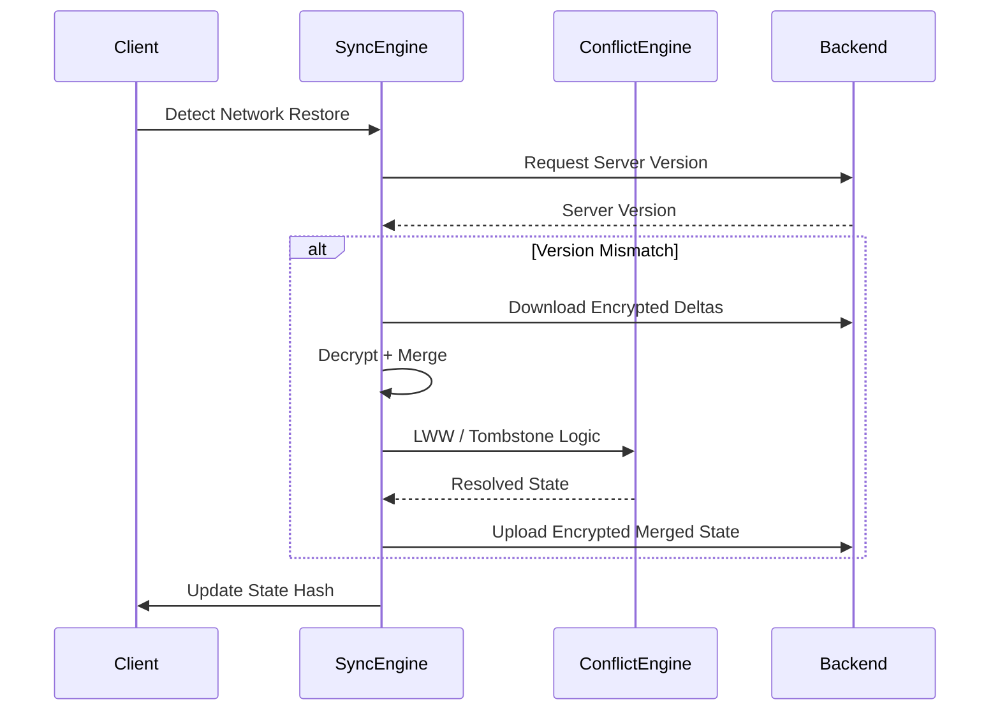

# ZeroVault


> **Zero-Knowledge Password Vault with Offline Synchronization**

ZeroVault is a secure, distributed password manager designed with privacy and reliability at its core. It employs a **Zero-Knowledge Architecture**, ensuring that your master password and sensitive data are encrypted client-side before ever reaching the server. With robust **offline support** and **conflict resolution**, your vault is always accessible and consistent across devices.

## 📋 Table of Contents
- [Intro](#zerovault)
- [Features](#-features)
- [Architecture](#-architecture)
- [Tech Stack](#-tech-stack)
- [Getting Started](#-getting-started)
- [Testing](#-testing)
- [Project Structure](#-project-structure)
- [Troubleshooting](#-troubleshooting)


## ✨ Features

- **🔒 Zero-Knowledge Security**: AES-GCM encryption happens entirely in the browser. The server never sees your raw passwords.
- **☁️ Offline Synchronization**: Make changes without an internet connection. ZeroVault queues your updates and syncs them automatically when you're back online.
- **⚔️ Conflict Resolution**: Smart versioning system detects conflicting edits. Implements a "Server-Wins" strategy with manual resolution prompts to ensure data integrity.
- **📱 Responsive Design**: Built with React and Tailwind CSS for a seamless experience on desktop and mobile.
- **⚡ Modern Stack**: Powered by Vite for lightning-fast development and build performance.

## 🏗️ Architecture

The following diagram illustrates the synchronization and conflict resolution flow when the client reconnects to the network:




## 🛠 Tech Stack

**Frontend**
- **React 19** with **TypeScript**
- **Vite** (Build Tool)
- **Tailwind CSS** (Styling)
- **Vitest** & **React Testing Library** (Testing)

**Backend**
- **Node.js** & **Express**
- **MongoDB** & **Mongoose**
- **JWT** (Authentication)
- **Jest** & **Supertest** (Testing)

## 🚀 Getting Started

### Prerequisites
- Node.js (v18+)
- MongoDB (Local or Atlas URI)

### Installation

1.  **Clone the repository**
    ```bash
    git clone https://github.com/yourusername/zero-vault.git
    cd zero-vault
    ```

2.  **Install Frontend Dependencies**
    ```bash
    npm install
    ```

3.  **Install Backend Dependencies**
    ```bash
    cd server
    npm install
    ```

### Running the Application

1.  **Start the Backend Server**
    Create a `.env` file in `server/` (see `server/.env.example`).
    ```bash
    cd server
    npm run dev
    # Server runs on http://localhost:5000
    ```

2.  **Start the Frontend Client**
    Open a new terminal in the root directory.
    ```bash
    npm run dev
    # Client runs on http://localhost:5173
    ```

## 🧪 Testing

ZeroVault maintains high code quality through rigorous testing of its synchronization and security logic.

### 🟢 Backend Tests (Sync Integrity)
Verifies the core delta sync algorithm, conflict detection (409 logic), and data persistence.

```bash
cd server
npm test
```
*Key scenarios covered: Delta Accept, Version Conflicts, Deduplication, Tombstones.*

### 🔵 Frontend Tests (Client Logic)
Validates the offline outbox queue, service logic, and component integration.

```bash
# Run all unit/integration tests
npm test

# Graphical UI mode for debugging
npm run test:ui

# Check code coverage
npm run test:coverage
```
*Key scenarios covered: Offline Queuing, Delta Calculation, Conflict Handling.*

## 📂 Project Structure

```
zero-vault/
├── src/                  # Frontend Source
│   ├── components/       # Reusable UI Components
│   ├── contexts/         # State Management (Vault, Auth)
│   ├── services/         # Business Logic (Sync, Crypto)
│   └── types/            # TypeScript Definitions
├── server/               # Backend Source
│   ├── src/
│   │   ├── models/       # Mongoose Schemas
│   │   ├── routes/       # API Endpoints
│   │   └── middleware/   # Auth & Validation
│   └── jest.config.js    # Backend Test Config
├── vite.config.ts        # Vite & Vitest Config
└── package.json          # Dependency Manifest
```

## 🔧 Troubleshooting

-   **Sync Conflict Error**: If you see a conflict error, refresh the page. ZeroVault enforces a "Server-Wins" policy to prevent data corruption. Your stale local changes will be discarded to converge with the server state.
-   **"ERR_REQUIRE_ESM"**: Ensure you are using `happy-dom` environment in Vitest (already configured in `vite.config.ts`).
-   **MongoDB Connection**: Verify your `MONGODB_URI` in `server/.env` is correct and the database service is running.

## 📄 License

Distributed under the MIT License. See `LICENSE` for more information.

## 🤝 Contributing

Contributions are what make the open source community such an amazing place to be learn, inspire, and create. Any contributions you make are **greatly appreciated**.

1. Fork the Project
2. Create your Feature Branch (`git checkout -b feature/AmazingFeature`)
3. Commit your Changes (`git commit -m 'Add some AmazingFeature'`)
4. Push to the Branch (`git push origin feature/AmazingFeature`)
5. Open a Pull Request
